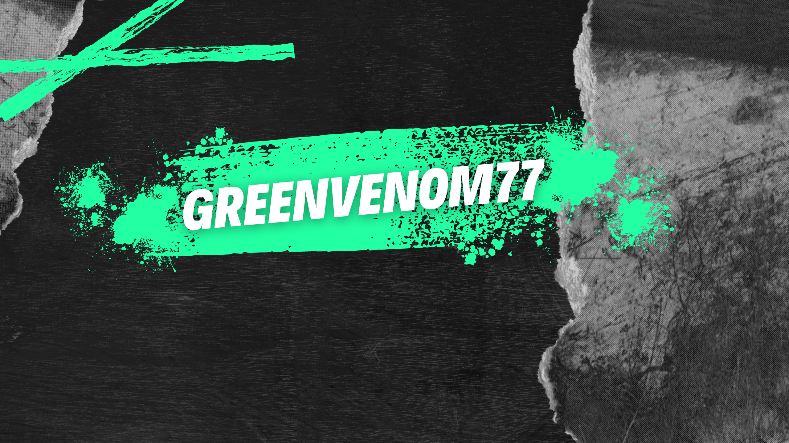

### Hi 👋, my name is Hossam Walid AKA GreenVenom77
#### Building Android Applications with Kotlin and Jetpack Compose.

  

## Tech Stack:
     

---

## About me :thinking: :

I am a dedicated Android Developer and Computer Science graduate from Suez University (2021-2025). 

My career started in Game Development, where I contributed to award-winning projects, but I transitioned to Mobile Development to focus on creating impactful applications.

I specialize in Android Development with expertise in Kotlin, Jetpack Compose, and modern Android architectures. 

My journey began with resources from Google's developer.android platform and formal training through the ITI Android Development track, equipping me with the skills to design, develop, and deliver high-quality applications.

My goal is to build efficient, user-focused mobile solutions that address real-world challenges.

I thrive in environments that value innovation, collaboration, and continuous learning.

---

- 🌱 I’m currently working on:
    
  - Personal project: [TrackHub](https://github.com/GreenVenom77/TrackHub) where you can keep track of your items whether they are out of stock or not like Kitchen needs, Warehouse items, etc…
  
- 📫 How to reach me: Send an email at hossamwalidgv@gmail.com or LinkedIn by clicking on the icon below.

 

